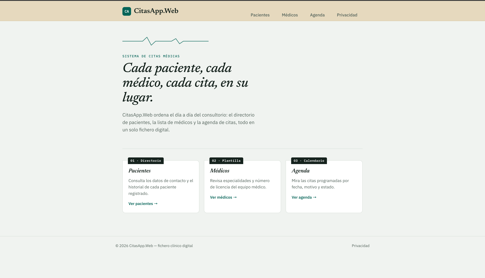
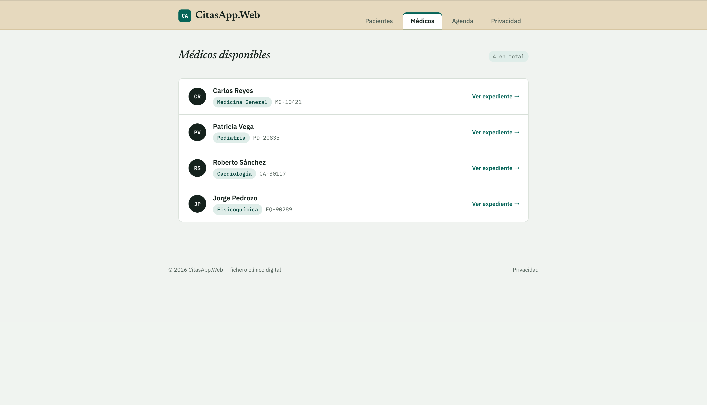

# ArqSoft-S05-Joshua

#  CitasApp – API REST con ASP.NET Core

API para gestionar citas médicas entre pacientes y médicos. Permite consultar citas, pacientes y médicos a través de peticiones HTTP.

---

## Tecnologías usadas

- **C#** – Lenguaje de programación
- **ASP.NET Core Web API** – Para crear los endpoints
- **.NET 10** – Plataforma de ejecución
- **Archivos JSON** – Almacenamiento de datos (sin base de datos externa)

---

## Cómo correr el proyecto

**Requisito:** tener instalado [.NET SDK](https://dotnet.microsoft.com/download)

```bash
git clone https://github.com/Joshua-221/ArqSoft-S05-Joshua.git
cd ArqSoft-S05-Joshua
dotnet run --project CitasApp.Api
```

La API estará disponible en: `http://localhost:5000`

---

## Endpoints disponibles

### Citas
| Método | Ruta | Descripción |
|---|---|---|
| `GET` | `/api/citas` | Lista todas las citas |
| `GET` | `/api/citas/porpaciente/{id}` | Citas de un paciente específico |

### Pacientes
| Método | Ruta | Descripción |
|---|---|---|
| `GET` | `/api/pacientes` | Lista todos los pacientes |
| `GET` | `/api/pacientes/{id}` | Busca un paciente por ID |

### Médicos
| Método | Ruta | Descripción |
|---|---|---|
| `GET` | `/api/medicos` | Lista todos los médicos |
| `GET` | `/api/medicos/{id}` | Busca un médico por ID |

---

## Capturas de pantalla

> Agrega aquí capturas de la API corriendo (por ejemplo desde el navegador o Postman)




---

## Alumno

**Joshua** – Arquitectura de Software, S05
